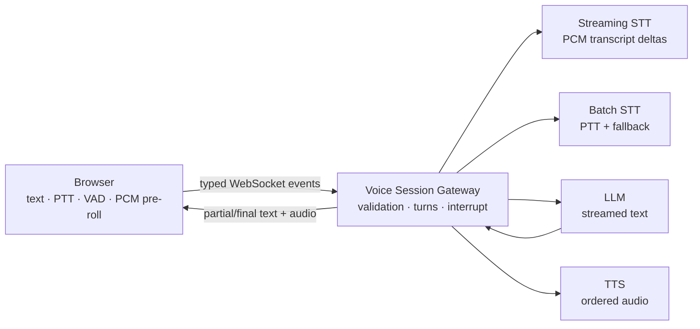

<p align="center">
  English · <a href="README.zh-CN.md">简体中文</a>
</p>

<p align="center">
  
</p>

<h1 align="center">OpenGPT Live</h1>

<p align="center">
  <strong>An open voice-AI session layer that can listen, speak, and be interrupted.</strong>
</p>

<p align="center">
  Browser VAD, live transcripts, streamed LLM responses, and TTS playback—connected by a typed WebSocket protocol you can inspect and replace.
</p>

<p align="center">
  <a href="#5-minute-quickstart">Quickstart</a> ·
  <a href="docs/protocol.md">Protocol</a> ·
  <a href="docs/configuration.md">Configuration</a> ·
  <a href="docs/deployment.md">Deployment</a> ·
  <a href="TODO.md">Roadmap</a> ·
  <a href="https://github.com/study8677/open-gpt-live/discussions">Discussions</a> ·
  <a href="CONTRIBUTING.md">Contribute</a>
</p>

<p align="center">
  <a href="https://github.com/study8677/open-gpt-live/actions/workflows/ci.yml"></a>
  
  
  
</p>


## Speak. See it. Hear it. Interrupt it.

```text
open your mic
  → see a live transcript
  → receive the answer as it is generated
  → hear the spoken response
  → start speaking to interrupt it
```

OpenGPT Live is a self-hostable realtime voice AI reference implementation for the session layer between browser audio and GPT-style model infrastructure. It keeps streaming STT, browser VAD, interruptible TTS, and WebSocket turn orchestration visible instead of hiding them behind a vendor-only client SDK.

## What works today

| Capability | Maturity | Implementation |
| --- | --- | --- |
| Text chat | Stable | Typed WebSocket messages and streamed Chat Completions output. |
| Push-to-talk | Stable | MediaRecorder chunks, full-turn STT, and a 25 MB guard. |
| Spoken replies | Stable | Sentence-segmented TTS and ordered browser playback. |
| Stop / interrupt | Stable | Abort propagation across LLM, TTS, playback, and late events. |
| Live Mode | Experimental | Adaptive browser RMS VAD with noise calibration, turn guards, and reconnect cleanup. |
| First-syllable protection | Experimental | A 400 ms PCM pre-roll is sent when VAD confirms speech. |
| Streaming STT | Experimental | OpenAI Realtime transcription with incremental deltas and batch WAV fallback. |
| Voice diagnostics | Stable | Per-turn latency and VAD panels expose first transcript, first token, first audio, noise floor, and thresholds. |
| Quality baseline | Stable | Runtime protocol validation, automated integration tests, CI, and production builds. |

## Provider compatibility

| Layer | Current verified path | Maturity |
| --- | --- | --- |
| LLM | OpenAI-compatible Chat Completions | Stable |
| Batch STT | OpenAI-compatible transcription API | Stable |
| Streaming STT | OpenAI Realtime transcription | Experimental |
| TTS | OpenAI-compatible speech API | Stable |
| Local AI | Pinned Ollama + Speaches/faster-whisper/Kokoro profile | Experimental; contract-tested, real-model acceptance pending |

## Why this project

- **Open protocol** — browser and Gateway behavior is described by shared TypeScript events, not an opaque transport.
- **Replaceable models** — LLM, batch STT, streaming STT, and TTS live behind provider interfaces.
- **Observable turns** — partial transcript, final transcript, text delta, audio chunk, completion, interruption, and error are explicit events.
- **Honest boundaries** — this repository is a voice-session reference implementation, not a hosted assistant or billing platform.

| | OpenGPT Live | Typical managed voice API |
| --- | --- | --- |
| Session protocol | Inspectable TypeScript events | Provider-defined |
| Model routing | Replaceable LLM/STT/TTS adapters | Usually tied to one platform |
| Local inference | Experimental Ollama + open-source speech profile | Usually cloud-first |
| Operations | You own deployment and tuning | Provider owns infrastructure |

## 5-minute quickstart

Requirements: Node.js 22.13+ and pnpm 11+.

```bash
pnpm install
cp .env.example .env
```

Set at least the LLM key in `.env`:

```dotenv
OPENAI_API_KEY=sk-your-key
```

Then start the Web app and Gateway:

```bash
pnpm dev
```

Open [http://localhost:3000](http://localhost:3000). Gateway health is available at [http://localhost:8787/healthz](http://localhost:8787/healthz).

### Local AI without a cloud key

The experimental Docker profile uses Ollama for the LLM and Speaches for open-source faster-whisper STT plus Kokoro TTS:

```bash
cp .env.local-ai.example .env
docker compose --profile local-ai up --build
```

The first start downloads about 1.8 GB of model weights plus container images. It requires no OpenAI key, but real microphone and local-model acceptance is still pending. See the [local AI guide](docs/local-ai.md) for health checks, the provider smoke script, resource notes, and the exact browser checklist.

### Useful profiles

Text replies without TTS:

```dotenv
TTS_ENABLED=false
```

Native streaming transcription for Live Mode:

```dotenv
STT_REALTIME_ENABLED=true
STT_REALTIME_MODEL=gpt-realtime-whisper
STT_REALTIME_DELAY=low
```

Realtime STT is opt-in because a generic OpenAI-compatible HTTP provider may not implement OpenAI's Realtime WebSocket protocol. See [configuration.md](docs/configuration.md) for separate keys, provider URLs, VAD tuning, and all environment variables.

## How it works



```text
apps/web             browser capture, VAD, pre-roll, playback, reconnect
apps/gateway         session state, protocol validation, STT/LLM/TTS orchestration
packages/protocol    shared client/server message contracts
packages/adapters    batch and streaming model-provider interfaces
```

The default Streaming STT adapter follows OpenAI's official [Realtime transcription protocol](https://developers.openai.com/api/docs/guides/realtime-transcription): 24 kHz mono PCM16 input, `input_audio_buffer.append`, manual commit, transcript deltas, and completed transcripts. Provider item IDs remain available inside the adapter for diagnostics; the Gateway maps each transcription session to one request ID.

## Quality and production commands

```bash
pnpm typecheck   # all workspaces
pnpm test        # protocol, Gateway, adapter, and browser-state tests
pnpm build       # bundled Gateway + optimized Next.js build
pnpm check       # all of the above
pnpm start       # start previously built processes with NODE_ENV=production
```

GitHub Actions runs type checking, tests, and production builds for every push and pull request. Docker and reverse-proxy instructions are in [deployment.md](docs/deployment.md).

## Current limits

- Conversation history lives only for the current WebSocket connection.
- Supplying an old `sessionId` does not restore previous messages.
- Adaptive RMS VAD cannot distinguish speech from every non-speech sound and does not replace acoustic echo cancellation.
- The Realtime STT adapter is currently OpenAI-specific; batch STT remains OpenAI-compatible.
- Authentication, billing, multi-tenant isolation, tools, and long-term memory are not included.
- Chromium is the verified browser baseline; see [browser-support.md](docs/browser-support.md) before claiming broader support.

These constraints are intentional. The next product layer should be built on a voice loop that is measurable and reliable.

## FAQ

**Can it run without an OpenAI key?** Yes. The experimental local profile uses Ollama, faster-whisper, and Kokoro; its real-device acceptance checklist is still open.

**Does local Live Mode produce partial transcripts?** Not yet. It uses batch STT after the turn ends. OpenAI Realtime remains the currently implemented partial-transcript path.

**Which browser should I use?** Chromium is the verified baseline. Firefox and Safari need the checks documented in [browser-support.md](docs/browser-support.md).

**Does adaptive VAD solve echo?** No. It calibrates ambient noise and improves turn timing, but it is not acoustic echo cancellation or a speech-classification model.

**Where is conversation data stored?** Session history stays in Gateway memory for the active WebSocket connection. The local profile routes inference through local containers; initial image and model downloads still contact external registries.

## Documentation

- [WebSocket protocol](docs/protocol.md)
- [Configuration reference](docs/configuration.md)
- [Local AI profile](docs/local-ai.md)
- [Live Mode smoke test](docs/live-mode-smoke-test.md)
- [Browser support](docs/browser-support.md)
- [Production deployment](docs/deployment.md)
- [Prioritized TODO](TODO.md)

## Contributing

Read [CONTRIBUTING.md](CONTRIBUTING.md), then run `pnpm check` before opening a pull request. Protocol or turn-lifecycle changes should include a regression test and keep the documentation aligned with the actual event order. Provider requests and device compatibility reports are welcome in [Discussions](https://github.com/study8677/open-gpt-live/discussions).

## License

[MIT](LICENSE)
