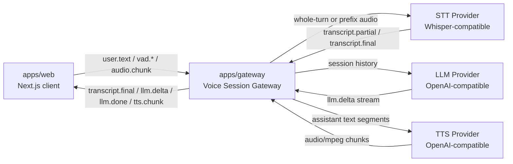

<p align="center">
  English
  ·
  <a href="README.zh-CN.md">简体中文</a>
</p>

<p align="center">
  
</p>

<h1 align="center">OpenGPT Live</h1>

<p align="center">
  Build realtime voice-first AI assistants with an open WebSocket protocol, pluggable model adapters, and a session gateway designed for GPT-style backends.
</p>

<p align="center">
  <a href="#quickstart">Quickstart</a>
  ·
  <a href="docs/protocol.md">Protocol</a>
  ·
  <a href="#architecture">Architecture</a>
  ·
  <a href="#roadmap">Roadmap</a>
</p>

<p align="center">
  
  
  
  
</p>

## What Is OpenGPT Live?

OpenGPT Live is a production-minded starter framework for building voice AI assistants that feel live, interruptible, and model-provider-flexible.

The core idea is simple:

```text
browser session
  -> WebSocket gateway
  -> speech-to-text
  -> GPT-style LLM stream
  -> realtime UI updates and speech playback
```

The project currently ships a focused MVP: browser text input, push-to-talk recording, experimental live voice mode with browser VAD and partial transcripts, in-memory session history, streamed LLM responses, and MP3 TTS playback.

## Why It Exists

Most voice AI demos are tightly coupled to one vendor API or hide the hard parts behind an opaque SDK. OpenGPT Live keeps the important boundaries visible:

- **Protocol first**: browser and gateway communicate through typed WebSocket events.
- **Provider flexible**: LLM, STT, and TTS live behind adapters, starting with OpenAI-compatible APIs.
- **Session aware**: each gateway connection owns conversation history and active response state.
- **Incremental by design**: text loop, push-to-talk, live VAD, and TTS are implemented as separable protocol layers.
- **Honest scope**: the MVP does not pretend to be a full agent platform.

## Current Capabilities

| Area | Status | Notes |
| --- | --- | --- |
| Text chat over WebSocket | Working | Browser text input streams through the gateway to the LLM. |
| Push-to-talk recording | Working | Uses `MediaRecorder` and sends `audio.chunk` events. |
| Live voice mode | Experimental | Browser-side RMS VAD marks speech turns and reuses `audio.chunk`. |
| Speech-to-text | Working | Whole-turn transcription through a Whisper-style API. |
| Partial transcript | Experimental | Retranscribes the accumulated WebM/Opus prefix every 2s, then every 5s after 30s. |
| LLM streaming | Working | OpenAI-compatible `/chat/completions` SSE parsing. |
| Interrupt | Working for LLM and TTS | Sends `interrupt` and aborts the active response request. |
| TTS / audio playback | Working | OpenAI-compatible `/audio/speech` response streamed to browser MP3 playback. |

## Architecture

```text
apps/web
  Next.js App Router client
  text input, push-to-talk, or live VAD audio -> WebSocket -> transcript/streaming display and audio playback

apps/gateway
  Node.js ws server
  audio aggregation + partial STT -> session history -> OpenAI-compatible LLM -> streamed deltas -> TTS chunks

packages/protocol
  shared WebSocket message types

packages/adapters
  provider interfaces and OpenAI-compatible LLM, STT, and TTS adapters
```



## Repository Layout

```text
apps/
  web/             Next.js App Router demo client
  gateway/         Node.js WebSocket gateway

packages/
  protocol/        Shared WebSocket message types
  adapters/        LLM, STT, and TTS provider interfaces

docs/
  protocol.md      Wire protocol and event schema

assets/
  brand/           Logo and brand assets
```

## Requirements

- Node.js 20+
- pnpm 11+
- OpenAI-compatible API key

## Quickstart

Install dependencies:

```bash
pnpm install
```

Create a local environment file:

```bash
cp .env.example .env
```

Edit `.env`:

```bash
OPENAI_API_KEY=sk-your-api-key
OPENAI_BASE_URL=https://api.openai.com/v1
OPENAI_MODEL=gpt-4o-mini
STT_API_KEY=
STT_BASE_URL=
STT_MODEL=whisper-1
TTS_API_KEY=
TTS_BASE_URL=
TTS_MODEL=tts-1
TTS_VOICE=alloy
TTS_FORMAT=mp3
GATEWAY_PORT=8787
NEXT_PUBLIC_GATEWAY_WS_URL=ws://localhost:8787
```

`STT_API_KEY` and `STT_BASE_URL` are optional. If they are empty, the gateway reuses `OPENAI_API_KEY` and `OPENAI_BASE_URL`. `STT_MODEL` defaults to `whisper-1`.
`TTS_API_KEY` and `TTS_BASE_URL` are optional. If they are empty, the gateway reuses `OPENAI_API_KEY` and `OPENAI_BASE_URL`. Leave both `TTS_API_KEY` and `OPENAI_API_KEY` empty to run in text-only mode.

Start the web app and gateway together:

```bash
pnpm dev
```

Open:

```text
http://localhost:3000
```

## Environment

| Variable | Required | Description |
| --- | --- | --- |
| `OPENAI_API_KEY` | Yes | API key for the default OpenAI-compatible LLM and fallback STT provider. |
| `OPENAI_BASE_URL` | No | Defaults to `https://api.openai.com/v1`. |
| `OPENAI_MODEL` | No | Defaults to `gpt-4o-mini`. |
| `STT_API_KEY` | No | Optional separate API key for STT. Falls back to `OPENAI_API_KEY`. |
| `STT_BASE_URL` | No | Optional separate base URL for STT. Falls back to `OPENAI_BASE_URL`. |
| `STT_MODEL` | No | Defaults to `whisper-1`. |
| `TTS_API_KEY` | No | Optional separate API key for TTS. Falls back to `OPENAI_API_KEY`; if no key is available, TTS is disabled. |
| `TTS_BASE_URL` | No | Optional separate base URL for TTS. Falls back to `OPENAI_BASE_URL`. |
| `TTS_MODEL` | No | Defaults to `tts-1`. |
| `TTS_VOICE` | No | Defaults to `alloy`. |
| `TTS_FORMAT` | No | Defaults to `mp3`; browser playback expects `audio/mpeg`. |
| `GATEWAY_PORT` | No | Defaults to `8787`. |
| `NEXT_PUBLIC_GATEWAY_WS_URL` | No | Defaults to `ws://localhost:8787`. |

## Smoke Test

1. Open `http://localhost:3000`.
2. Confirm the page shows `Connected`.
3. Type a message and click `Send`.
4. Confirm the assistant response appears incrementally.
5. If TTS is configured, confirm the response also plays as audio. If the browser blocks autoplay, click `播放语音回复`.
6. Send a second text message and confirm the answer can refer to the previous turn.
7. Hold `Hold to Talk`, say a short phrase, then release.
8. Confirm the transcript appears as a user message, then the assistant streams a reply.
9. Click `Live experimental`, speak without holding the button, then pause.
10. Confirm a gray italic partial transcript appears first, then it is replaced by the final transcript.
11. While TTS is playing in live mode, speak again and confirm playback stops immediately.
12. Deny microphone permission in the browser and confirm text input still works.
13. While a response is streaming or playing, click `Stop`.
14. Confirm streaming and playback stop immediately.

## Protocol

The WebSocket protocol is documented in [docs/protocol.md](docs/protocol.md). The most important implemented events are:

| Event | Direction | Purpose |
| --- | --- | --- |
| `session.start` | client -> gateway, gateway -> client | Start or confirm a browser session. |
| `user.text` | client -> gateway | Submit text into the active conversation. |
| `audio.chunk` | client -> gateway | Send MediaRecorder chunks for a push-to-talk turn. |
| `vad.speech_start` | client -> gateway | Mark the start of an experimental live-mode speech turn. |
| `vad.speech_end` | client -> gateway | Mark the end of an experimental live-mode speech turn. |
| `transcript.partial` | gateway -> client | Return an interim transcript for an active live-mode turn. |
| `transcript.final` | gateway -> client | Return final STT text for an audio turn. |
| `llm.delta` | gateway -> client | Stream assistant text chunks. |
| `llm.done` | gateway -> client | Mark completion, interruption, or error. |
| `tts.start` | gateway -> client | Start a generated speech stream. |
| `tts.chunk` | gateway -> client | Stream generated speech as base64 MP3 chunks. |
| `tts.end` | gateway -> client | Mark generated speech completion, interruption, or error. |
| `playback.ack` | client -> gateway | Acknowledge played TTS chunks. |
| `interrupt` | client -> gateway | Abort the active LLM/TTS stream. |

## Live Mode Notes

`Live experimental` is off by default. It uses browser-side RMS VAD with these code-level defaults: speech threshold `0.02`, silence threshold `0.012`, 160 ms speech debounce, 750 ms hangover, 30 s max turn, 250 ms MediaRecorder chunks, 2.5x threshold while TTS is playing, and a 300 ms VAD suppression window after playback ends.

Partial transcripts reuse the batch STT adapter by retranscribing the accumulated WebM/Opus prefix for the current turn. The gateway tries every 2 seconds, then every 5 seconds after a turn exceeds 30 seconds, and skips a tick if a previous partial STT call is still in flight.

For a manual checklist, see [docs/live-mode-smoke-test.md](docs/live-mode-smoke-test.md).

## Development Commands

Run both apps:

```bash
pnpm dev
```

Typecheck all workspaces:

```bash
pnpm typecheck
```

## Engineering Principles

- Keep browser, protocol, gateway, and provider adapters separate.
- Prefer typed message contracts over implicit frontend/backend coupling.
- Keep model providers replaceable.
- Make partial progress observable through explicit events.
- Keep MVP behavior boring and debuggable before optimizing for low latency.
- Avoid adding auth, billing, persistence, or Docker until the realtime loop is stable.

## Use Cases

- Voice-first copilots for internal tools.
- Customer support assistants that need transcripts and live responses.
- AI tutoring and language-learning prototypes.
- Research demos for realtime LLM gateway architecture.
- Portfolio-grade projects showing WebSocket, streaming, provider abstraction, and audio pipeline work.

## Roadmap

The long-term goal is a voice-first AI assistant framework:

```text
realtime voice layer
  -> gateway session orchestration
  -> OpenAI-compatible or local LLM providers
  -> tools, memory, search, and agent workflows
```

The current milestone keeps the surface deliberately small so the protocol, whole-turn transcription, streaming, TTS playback, context handling, and interruption semantics are correct before realtime audio features are added.

Near-term roadmap:

- [x] Text loop over WebSocket.
- [x] Push-to-talk recording and whole-turn STT.
- [x] TTS provider and browser playback.
- [x] Clearer response interruption state machine.
- [ ] Tool registry and simple function calls.
- [ ] Persistent memory adapter.
- [ ] Realtime STT and partial transcript events.
- [ ] Production deployment guide.

## What This Is Not

OpenGPT Live is not a hosted voice assistant service, a billing platform, or a closed SDK wrapper. It is an open reference implementation for the realtime session layer between browser audio UX and GPT-style model infrastructure.

## License

MIT
