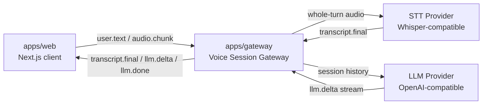

<p align="center">
  English
  ·
  <a href="README.zh-CN.md">简体中文</a>
</p>

<p align="center">
  
</p>

<h1 align="center">OpenGPT Live</h1>

<p align="center">
  Build realtime voice-first AI assistants with an open WebSocket protocol, pluggable model adapters, and a session gateway designed for GPT-style backends.
</p>

<p align="center">
  <a href="#quickstart">Quickstart</a>
  ·
  <a href="docs/protocol.md">Protocol</a>
  ·
  <a href="#architecture">Architecture</a>
  ·
  <a href="#roadmap">Roadmap</a>
</p>

<p align="center">
  
  
  
  
</p>

## What Is OpenGPT Live?

OpenGPT Live is a production-minded starter framework for building voice AI assistants that feel live, interruptible, and model-provider-flexible.

The core idea is simple:

```text
browser session
  -> WebSocket gateway
  -> speech-to-text
  -> GPT-style LLM stream
  -> realtime UI updates
```

The project currently ships a focused MVP: browser text input, push-to-talk recording, whole-turn STT transcription, in-memory session history, and streamed LLM responses.

## Why It Exists

Most voice AI demos are tightly coupled to one vendor API or hide the hard parts behind an opaque SDK. OpenGPT Live keeps the important boundaries visible:

- **Protocol first**: browser and gateway communicate through typed WebSocket events.
- **Provider flexible**: LLM and STT live behind adapters, starting with OpenAI-compatible APIs.
- **Session aware**: each gateway connection owns conversation history and active response state.
- **Incremental by design**: text loop first, push-to-talk second, TTS and richer interruption state machines later.
- **Honest scope**: the MVP does not pretend to be a full agent platform.

## Current Capabilities

| Area | Status | Notes |
| --- | --- | --- |
| Text chat over WebSocket | Working | Browser text input streams through the gateway to the LLM. |
| Push-to-talk recording | Working | Uses `MediaRecorder` and sends `audio.chunk` events. |
| Speech-to-text | Working | Whole-turn transcription through a Whisper-style API. |
| LLM streaming | Working | OpenAI-compatible `/chat/completions` SSE parsing. |
| Interrupt | Working for LLM stream | Sends `interrupt` and aborts the active LLM request. |
| TTS / audio playback | Not yet | Planned for the next milestone. |
| Realtime STT / VAD | Not yet | Reserved in the protocol, intentionally out of MVP scope. |

## Architecture

```text
apps/web
  Next.js App Router client
  text input or push-to-talk audio -> WebSocket -> transcript/streaming display

apps/gateway
  Node.js ws server
  audio aggregation -> STT -> session history -> OpenAI-compatible LLM -> streamed deltas

packages/protocol
  shared WebSocket message types

packages/adapters
  provider interfaces and OpenAI-compatible LLM adapter
```



## Repository Layout

```text
apps/
  web/             Next.js App Router demo client
  gateway/         Node.js WebSocket gateway

packages/
  protocol/        Shared WebSocket message types
  adapters/        LLM, STT, and TTS provider interfaces

docs/
  protocol.md      Wire protocol and event schema

assets/
  brand/           Logo and brand assets
```

## Requirements

- Node.js 20+
- pnpm 11+
- OpenAI-compatible API key

## Quickstart

Install dependencies:

```bash
pnpm install
```

Create a local environment file:

```bash
cp .env.example .env
```

Edit `.env`:

```bash
OPENAI_API_KEY=sk-your-api-key
OPENAI_BASE_URL=https://api.openai.com/v1
OPENAI_MODEL=gpt-4o-mini
STT_API_KEY=
STT_BASE_URL=
STT_MODEL=whisper-1
GATEWAY_PORT=8787
NEXT_PUBLIC_GATEWAY_WS_URL=ws://localhost:8787
```

`STT_API_KEY` and `STT_BASE_URL` are optional. If they are empty, the gateway reuses `OPENAI_API_KEY` and `OPENAI_BASE_URL`. `STT_MODEL` defaults to `whisper-1`.

Start the web app and gateway together:

```bash
pnpm dev
```

Open:

```text
http://localhost:3000
```

## Environment

| Variable | Required | Description |
| --- | --- | --- |
| `OPENAI_API_KEY` | Yes | API key for the default OpenAI-compatible LLM and fallback STT provider. |
| `OPENAI_BASE_URL` | No | Defaults to `https://api.openai.com/v1`. |
| `OPENAI_MODEL` | No | Defaults to `gpt-4o-mini`. |
| `STT_API_KEY` | No | Optional separate API key for STT. Falls back to `OPENAI_API_KEY`. |
| `STT_BASE_URL` | No | Optional separate base URL for STT. Falls back to `OPENAI_BASE_URL`. |
| `STT_MODEL` | No | Defaults to `whisper-1`. |
| `GATEWAY_PORT` | No | Defaults to `8787`. |
| `NEXT_PUBLIC_GATEWAY_WS_URL` | No | Defaults to `ws://localhost:8787`. |

## Smoke Test

1. Open `http://localhost:3000`.
2. Confirm the page shows `Connected`.
3. Type a message and click `Send`.
4. Confirm the assistant response appears incrementally.
5. Send a second text message and confirm the answer can refer to the previous turn.
6. Hold `Hold to Talk`, say a short phrase, then release.
7. Confirm the transcript appears as a user message, then the assistant streams a reply.
8. Deny microphone permission in the browser and confirm text input still works.
9. While a response is streaming, click `Stop`.
10. Confirm streaming stops immediately.

## Protocol

The WebSocket protocol is documented in [docs/protocol.md](docs/protocol.md). The most important implemented events are:

| Event | Direction | Purpose |
| --- | --- | --- |
| `session.start` | client -> gateway, gateway -> client | Start or confirm a browser session. |
| `user.text` | client -> gateway | Submit text into the active conversation. |
| `audio.chunk` | client -> gateway | Send MediaRecorder chunks for a push-to-talk turn. |
| `transcript.final` | gateway -> client | Return final STT text for an audio turn. |
| `llm.delta` | gateway -> client | Stream assistant text chunks. |
| `llm.done` | gateway -> client | Mark completion, interruption, or error. |
| `interrupt` | client -> gateway | Abort the active LLM stream. |

Reserved future events include `transcript.partial` and `tts.chunk`.

## Development Commands

Run both apps:

```bash
pnpm dev
```

Typecheck all workspaces:

```bash
pnpm typecheck
```

## Engineering Principles

- Keep browser, protocol, gateway, and provider adapters separate.
- Prefer typed message contracts over implicit frontend/backend coupling.
- Keep model providers replaceable.
- Make partial progress observable through explicit events.
- Keep MVP behavior boring and debuggable before optimizing for low latency.
- Avoid adding auth, billing, persistence, or Docker until the realtime loop is stable.

## Use Cases

- Voice-first copilots for internal tools.
- Customer support assistants that need transcripts and live responses.
- AI tutoring and language-learning prototypes.
- Research demos for realtime LLM gateway architecture.
- Portfolio-grade projects showing WebSocket, streaming, provider abstraction, and audio pipeline work.

## Roadmap

The long-term goal is a voice-first AI assistant framework:

```text
realtime voice layer
  -> gateway session orchestration
  -> OpenAI-compatible or local LLM providers
  -> tools, memory, search, and agent workflows
```

The current milestone keeps the surface deliberately small so the protocol, whole-turn transcription, streaming, context handling, and interruption semantics are correct before TTS and realtime audio features are added.

Near-term roadmap:

- [x] Text loop over WebSocket.
- [x] Push-to-talk recording and whole-turn STT.
- [ ] TTS provider and browser playback.
- [ ] Clearer response interruption state machine.
- [ ] Tool registry and simple function calls.
- [ ] Persistent memory adapter.
- [ ] Realtime STT and partial transcript events.
- [ ] Production deployment guide.

## What This Is Not

OpenGPT Live is not a hosted voice assistant service, a billing platform, or a closed SDK wrapper. It is an open reference implementation for the realtime session layer between browser audio UX and GPT-style model infrastructure.

## License

MIT
