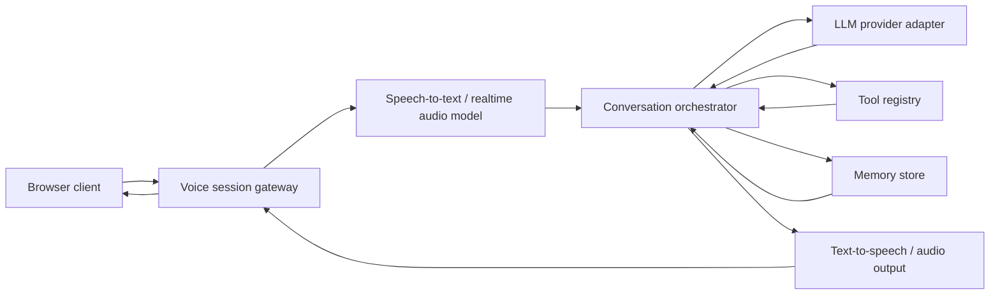

# OpenGPT Live

OpenGPT Live is an open-source realtime voice interface for GPT-style AI assistants backed by large language models.

The project goal is to make it easy for developers and users to build voice-first AI experiences where a lightweight realtime voice layer handles listening, speaking, interruption, and conversation flow, while a powerful background model handles reasoning, search, memory, and tool use.

## Why This Project

Most voice AI products still behave like text chat with a microphone:

```text
speech -> transcription -> LLM response -> text-to-speech
```

That works for simple commands, but it does not feel like natural collaboration. OpenGPT Live focuses on a more practical architecture:

```text
realtime voice interaction layer
  -> background LLM reasoning
  -> tools, memory, search, and agent workflows
  -> natural voice response
```

## Core Ideas

- Realtime voice should be a first-class interface, not just an input method.
- The voice layer should focus on latency, interruption, turn-taking, and natural feedback.
- Deep reasoning should be delegated to stronger background models.
- Tool calls, search, memory, and long-running tasks should continue without freezing the voice conversation.
- The project should be provider-flexible, so users can connect OpenAI-compatible APIs, local models, or other LLM providers.

## MVP Scope

The first version should focus on a small but complete voice assistant loop.

### 1. Realtime Voice Session

- Browser microphone capture.
- Low-latency audio streaming to the backend.
- Speech activity detection.
- Interruptible assistant speech.
- Text transcript shown beside the voice session.

### 2. LLM Backend Adapter

- OpenAI-compatible chat/completions or realtime adapter.
- Configurable model provider and API key.
- Streaming response support.
- Simple tool-call interface.

### 3. Speech Pipeline

The MVP can start with a cascaded pipeline:

```text
microphone -> speech-to-text -> LLM -> text-to-speech -> speaker
```

Then evolve toward a more realtime architecture:

```text
audio stream -> realtime model / voice gateway -> background reasoning model -> voice output
```

### 4. Basic Tools

Start with a few useful tools:

- Web search placeholder or adapter.
- Current time/date.
- Simple memory notes.
- Local knowledge file lookup.

### 5. Developer Experience

- One-command local startup.
- Clear environment variable examples.
- Simple provider configuration.
- Minimal demo page.
- Docker Compose for local testing.

## Suggested Architecture



## Recommended First Milestone

Milestone 0 should prove the full loop:

1. Open the web page.
2. Click the microphone button.
3. Speak a question.
4. See live transcript.
5. Receive a streamed model answer.
6. Hear the answer as speech.
7. Interrupt the answer and ask a follow-up.

This milestone is more important than building many tools. The project should first prove that the realtime voice loop is usable.

## Non-Goals for the First Version

- Do not build a full agent platform immediately.
- Do not support every model provider in the first release.
- Do not start with complex account systems or billing.
- Do not overfit to one proprietary realtime API.
- Do not hide the architecture behind magic. Keep adapters clear and replaceable.

## Roadmap

### Phase 1: Local Demo

- Web client with microphone and transcript.
- Node.js or Python backend.
- Basic STT, LLM, and TTS adapters.
- Interruptible response playback.
- `.env.example` and local setup docs.

### Phase 2: Provider Abstraction

- OpenAI-compatible LLM adapter.
- Pluggable STT adapter.
- Pluggable TTS adapter.
- Model/provider config file.
- Basic tool registry.

### Phase 3: Realtime Interaction

- Better voice activity detection.
- Full-duplex-style interaction where possible.
- Background reasoning delegation.
- Live task status updates.
- Better interruption and pause handling.

### Phase 4: Agent Capabilities

- Web search.
- Local documents and knowledge base.
- Persistent memory.
- Multi-step tool workflows.
- Session replay and debugging.

### Phase 5: Production Readiness

- Authentication.
- Rate limits.
- Deployment templates.
- Observability.
- Safety controls.
- Documentation site.

## License

License to be decided.
