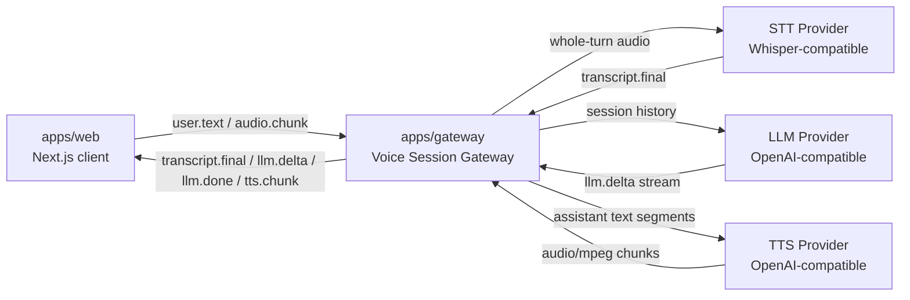

<p align="center">
  <a href="README.md">English</a>
  ·
  简体中文
</p>

<p align="center">
  
</p>

<h1 align="center">OpenGPT Live</h1>

<p align="center">
  用开放 WebSocket 协议、可插拔模型适配器和会话网关，构建实时语音优先的 GPT 风格 AI 助手。
</p>

<p align="center">
  <a href="#快速开始">快速开始</a>
  ·
  <a href="docs/protocol.md">协议文档</a>
  ·
  <a href="#架构">架构</a>
  ·
  <a href="#路线图">路线图</a>
</p>

<p align="center">
  
  
  
  
</p>

## OpenGPT Live 是什么？

OpenGPT Live 是一个面向生产实践的实时语音 AI 助手 starter framework。它关注的是浏览器语音体验和 GPT 风格后端模型之间的会话层：实时、可中断、可替换模型供应商，并且协议边界清晰。

核心链路很简单：

```text
浏览器会话
  -> WebSocket Gateway
  -> 语音转文字
  -> GPT 风格 LLM 流式输出
  -> 前端实时更新和语音播放
```

当前版本提供一个聚焦的 MVP：浏览器文本输入、按住说话、整段 STT 转写、内存会话历史、LLM 流式回复，以及 MP3 TTS 播放。

## 为什么做这个项目？

很多语音 AI demo 都和某个厂商 API 强绑定，或者把关键工程问题藏在不透明 SDK 后面。OpenGPT Live 的目标是把这些关键边界暴露出来，让开发者可以真正掌控实时语音 AI 应用的架构。

- **协议优先**：浏览器和 Gateway 通过类型化 WebSocket 事件通信。
- **模型可替换**：LLM、STT 和 TTS 都在 adapter 后面，先支持 OpenAI-compatible API。
- **会话感知**：每个 Gateway 连接维护自己的对话历史和活跃响应状态。
- **渐进式演进**：文本、按住说话和 TTS 都作为可分离的协议层实现。
- **边界诚实**：当前 MVP 不伪装成完整 Agent 平台。

## 当前能力

| 模块 | 状态 | 说明 |
| --- | --- | --- |
| WebSocket 文本聊天 | 已完成 | 浏览器文本输入经 Gateway 流式调用 LLM。 |
| 按住说话 | 已完成 | 使用 `MediaRecorder`，通过 `audio.chunk` 发送音频片段。 |
| 语音转文字 | 已完成 | 通过 Whisper 风格 API 做整段转写。 |
| LLM 流式输出 | 已完成 | 解析 OpenAI-compatible `/chat/completions` SSE。 |
| 中断 | LLM 和 TTS 已完成 | 发送 `interrupt`，Gateway abort 当前响应请求。 |
| TTS / 语音播放 | 已完成 | OpenAI-compatible `/audio/speech` 响应流式发送到浏览器 MP3 播放队列。 |
| 实时 STT / VAD | 未实现 | 协议已预留，当前 MVP 不做。 |

## 架构

```text
apps/web
  Next.js App Router 客户端
  文本输入或按住说话 -> WebSocket -> 转写文本/流式回复展示和语音播放

apps/gateway
  Node.js ws 服务
  音频聚合 -> STT -> 会话历史 -> OpenAI-compatible LLM -> 流式 delta -> TTS chunks

packages/protocol
  共享 WebSocket 消息类型

packages/adapters
  LLM、STT、TTS provider 接口与默认实现
```



## 仓库结构

```text
apps/
  web/             Next.js App Router demo client
  gateway/         Node.js WebSocket gateway

packages/
  protocol/        共享 WebSocket 消息类型
  adapters/        LLM、STT、TTS provider 接口

docs/
  protocol.md      WebSocket 协议和事件 schema

assets/
  brand/           Logo 和品牌资产
```

## 环境要求

- Node.js 20+
- pnpm 11+
- OpenAI-compatible API key

## 快速开始

安装依赖：

```bash
pnpm install
```

创建本地环境变量文件：

```bash
cp .env.example .env
```

编辑 `.env`：

```bash
OPENAI_API_KEY=sk-your-api-key
OPENAI_BASE_URL=https://api.openai.com/v1
OPENAI_MODEL=gpt-4o-mini
STT_API_KEY=
STT_BASE_URL=
STT_MODEL=whisper-1
TTS_API_KEY=
TTS_BASE_URL=
TTS_MODEL=tts-1
TTS_VOICE=alloy
TTS_FORMAT=mp3
GATEWAY_PORT=8787
NEXT_PUBLIC_GATEWAY_WS_URL=ws://localhost:8787
```

`STT_API_KEY` 和 `STT_BASE_URL` 是可选项。为空时，Gateway 会复用 `OPENAI_API_KEY` 和 `OPENAI_BASE_URL`。`STT_MODEL` 默认是 `whisper-1`。
`TTS_API_KEY` 和 `TTS_BASE_URL` 是可选项。为空时，Gateway 会复用 `OPENAI_API_KEY` 和 `OPENAI_BASE_URL`。如果 `TTS_API_KEY` 和 `OPENAI_API_KEY` 都为空，Gateway 会优雅降级为纯文本模式。

同时启动 Web 和 Gateway：

```bash
pnpm dev
```

打开：

```text
http://localhost:3000
```

## 环境变量

| 变量 | 必填 | 说明 |
| --- | --- | --- |
| `OPENAI_API_KEY` | 是 | 默认 LLM 和 fallback STT provider 使用的 API key。 |
| `OPENAI_BASE_URL` | 否 | 默认 `https://api.openai.com/v1`。 |
| `OPENAI_MODEL` | 否 | 默认 `gpt-4o-mini`。 |
| `STT_API_KEY` | 否 | STT 单独 API key，默认回退到 `OPENAI_API_KEY`。 |
| `STT_BASE_URL` | 否 | STT 单独 base URL，默认回退到 `OPENAI_BASE_URL`。 |
| `STT_MODEL` | 否 | 默认 `whisper-1`。 |
| `TTS_API_KEY` | 否 | TTS 单独 API key，默认回退到 `OPENAI_API_KEY`；如果没有可用 key，则禁用 TTS。 |
| `TTS_BASE_URL` | 否 | TTS 单独 base URL，默认回退到 `OPENAI_BASE_URL`。 |
| `TTS_MODEL` | 否 | 默认 `tts-1`。 |
| `TTS_VOICE` | 否 | 默认 `alloy`。 |
| `TTS_FORMAT` | 否 | 默认 `mp3`；浏览器播放按 `audio/mpeg` 处理。 |
| `GATEWAY_PORT` | 否 | 默认 `8787`。 |
| `NEXT_PUBLIC_GATEWAY_WS_URL` | 否 | 默认 `ws://localhost:8787`。 |

## 验收流程

1. 打开 `http://localhost:3000`。
2. 确认页面显示 `Connected`。
3. 输入文字并点击 `Send`。
4. 确认助手回复会逐字流式出现。
5. 如果已配置 TTS，确认回复也会播放语音；如果浏览器阻止自动播放，点击 `播放语音回复`。
6. 再发送第二条文本，确认模型能引用上一轮上下文。
7. 按住 `Hold to Talk`，说一句话后松开。
8. 确认页面先显示转写文本，再流式显示助手回复。
9. 在浏览器中拒绝麦克风权限，确认页面有明确提示且文字输入仍可用。
10. 在回复流式输出或播放时点击 `Stop`。
11. 确认流式输出和语音播放立即停止。

## 协议

WebSocket 协议见 [docs/protocol.md](docs/protocol.md)。当前最重要的事件包括：

| 事件 | 方向 | 用途 |
| --- | --- | --- |
| `session.start` | client -> gateway, gateway -> client | 启动或确认浏览器会话。 |
| `user.text` | client -> gateway | 将文本提交到当前会话。 |
| `audio.chunk` | client -> gateway | 发送按住说话产生的 MediaRecorder 音频片段。 |
| `transcript.final` | gateway -> client | 返回音频轮次的最终转写文本。 |
| `llm.delta` | gateway -> client | 流式返回助手文本片段。 |
| `llm.done` | gateway -> client | 标记完成、中断或错误。 |
| `tts.start` | gateway -> client | 开始生成语音流。 |
| `tts.chunk` | gateway -> client | 以 base64 MP3 chunk 流式返回生成语音。 |
| `tts.end` | gateway -> client | 标记生成语音完成、中断或错误。 |
| `playback.ack` | client -> gateway | 确认浏览器已播放 TTS chunk。 |
| `interrupt` | client -> gateway | 中断当前 LLM 流式请求。 |

预留事件包括 `transcript.partial`。

## 开发命令

同时启动两个应用：

```bash
pnpm dev
```

检查所有 workspace 类型：

```bash
pnpm typecheck
```

## 工程原则

- 保持浏览器、协议、Gateway 和 provider adapter 的职责分离。
- 优先使用类型化消息契约，避免隐式前后端耦合。
- 保持模型供应商可替换。
- 用显式事件让部分进度可观察。
- 在优化低延迟之前，先保证 MVP 行为稳定、可调试。
- 在实时链路稳定前，不急于加入鉴权、计费、持久化或 Docker。

## 适用场景

- 面向内部工具的语音优先 copilots。
- 需要转写和实时回复的客服助手。
- AI 辅导和语言学习原型。
- 实时 LLM Gateway 架构研究 demo。
- 展示 WebSocket、流式输出、模型抽象和音频链路能力的作品集项目。

## 路线图

长期目标是构建一个语音优先的 AI 助手框架：

```text
realtime voice layer
  -> gateway session orchestration
  -> OpenAI-compatible or local LLM providers
  -> tools, memory, search, and agent workflows
```

当前里程碑刻意保持范围收敛：先把协议、整段转写、流式输出、TTS 播放、上下文处理和中断语义打稳，再进入更实时的音频能力。

近期路线图：

- [x] WebSocket 文本回路。
- [x] 按住说话和整段 STT。
- [x] TTS provider 和浏览器播放。
- [x] 更清晰的响应中断状态机。
- [ ] 工具注册表和简单 function calls。
- [ ] 持久化记忆 adapter。
- [ ] 实时 STT 和 partial transcript 事件。
- [ ] 生产部署指南。

## 这个项目不是什么？

OpenGPT Live 不是托管语音助手服务，不是计费平台，也不是封闭 SDK wrapper。它是浏览器语音 UX 和 GPT 风格模型基础设施之间的实时会话层开源参考实现。

## License

MIT
