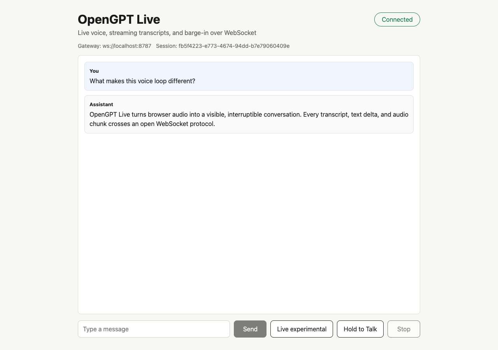
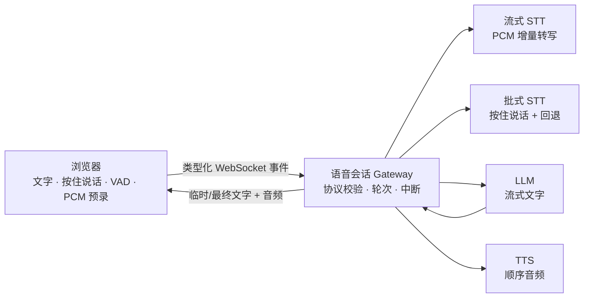

<p align="center">
  <a href="README.md">English</a> · 简体中文
</p>

<p align="center">
  
</p>

<h1 align="center">OpenGPT Live</h1>

<p align="center">
  <strong>一个可以听、说、被打断的开放语音 AI 会话层。</strong>
</p>

<p align="center">
  浏览器语音检测、实时转写、流式回答和语音播放，都通过可检查、可替换的 WebSocket 协议连接。
</p>

<p align="center">
  <a href="#5-分钟快速开始">快速开始</a> ·
  <a href="docs/protocol.md">协议</a> ·
  <a href="docs/configuration.md">配置</a> ·
  <a href="docs/deployment.md">部署</a> ·
  <a href="TODO.md">路线图</a> ·
  <a href="https://github.com/study8677/open-gpt-live/discussions">讨论区</a> ·
  <a href="CONTRIBUTING.md">参与贡献</a>
</p>

<p align="center">
  <a href="https://github.com/study8677/open-gpt-live/actions/workflows/ci.yml"></a>
  
  
  
</p>



## 开口说话，看见转写，听到回答，随时插话

```text
打开麦克风
  → 实时看到转写
  → 回答边生成边出现
  → 浏览器播放语音
  → 再次开口，立即打断
```

OpenGPT Live 是一份可自托管的实时语音 AI 参考实现，位于浏览器音频与 GPT 风格模型基础设施之间。它没有用封闭 SDK 隐藏实时链路，而是把流式 STT、浏览器 VAD、可打断 TTS、会话和音频事件完整暴露出来。

## 当前真正可用的能力

| 能力 | 成熟度 | 当前实现 |
| --- | --- | --- |
| 文字对话 | 稳定 | 类型化 WebSocket 消息和 Chat Completions 流式输出。 |
| 按住说话 | 稳定 | MediaRecorder 分块、整段转写和 25 MB 上限。 |
| 语音回答 | 稳定 | 按句生成 TTS，浏览器按顺序播放。 |
| 停止与打断 | 稳定 | LLM、TTS、播放和迟到事件统一取消。 |
| 连续语音模式 | 实验性 | 浏览器自适应 RMS 语音检测、环境噪声校准、轮次保护和断线清理。 |
| 句首保护 | 实验性 | 语音开始确认前保留 400 ms PCM，减少第一个字被截断。 |
| 流式语音转写 | 实验性 | OpenAI Realtime 增量转写，失败后自动回退到批式 WAV 转写。 |
| 语音诊断 | 稳定 | 每轮展示首个转写、LLM 首字、TTS 首音、噪声基线和动态阈值。 |
| 工程基线 | 稳定 | 运行时协议校验、自动化测试、CI 和生产构建。 |

## Provider 兼容性

| 层 | 当前已验证路径 | 成熟度 |
| --- | --- | --- |
| LLM | OpenAI-compatible Chat Completions | 稳定 |
| 批式 STT | OpenAI-compatible transcription API | 稳定 |
| 流式 STT | OpenAI Realtime transcription | 实验性 |
| TTS | OpenAI-compatible speech API | 稳定 |
| 本地 AI | Ollama + 开源 STT/TTS profile | v0.3 计划中 |

## 为什么值得做

- **协议开放**：浏览器和 Gateway 的行为由共享 TypeScript 事件描述，不依赖黑盒传输层。
- **模型可替换**：LLM、批式 STT、流式 STT 和 TTS 都在独立 Provider 接口之后。
- **过程可观察**：临时转写、最终转写、文字增量、音频分块、完成、中断和错误都有明确事件。
- **边界诚实**：这是语音会话层参考实现，不是托管助手、计费平台或万能 Agent 框架。

## 5 分钟快速开始

需要 Node.js 22.13+ 和 pnpm 11+。

```bash
pnpm install
cp .env.example .env
```

在 `.env` 中至少配置 LLM Key：

```dotenv
OPENAI_API_KEY=sk-your-key
```

启动 Web 和 Gateway：

```bash
pnpm dev
```

打开 [http://localhost:3000](http://localhost:3000)。Gateway 健康检查位于 [http://localhost:8787/healthz](http://localhost:8787/healthz)。

### 常用模式

只要文字回答，不播放 TTS：

```dotenv
TTS_ENABLED=false
```

为连续语音模式启用真正的流式转写：

```dotenv
STT_REALTIME_ENABLED=true
STT_REALTIME_MODEL=gpt-realtime-whisper
STT_REALTIME_DELAY=low
```

流式 STT 默认关闭，因为普通的 OpenAI-compatible HTTP 服务不一定实现 OpenAI Realtime WebSocket 协议。独立密钥、模型地址、VAD 参数和完整环境变量见 [配置文档](docs/configuration.md)。

## 工作原理



```text
apps/web             浏览器采集、VAD、预录、播放和重连
apps/gateway         会话状态、协议校验、STT/LLM/TTS 编排
packages/protocol    前后端共享消息契约
packages/adapters    批式与流式模型 Provider 接口
```

默认流式 STT Adapter 遵循 OpenAI 官方 [Realtime transcription 协议](https://developers.openai.com/api/docs/guides/realtime-transcription)：24 kHz 单声道 PCM16、`input_audio_buffer.append`、手动提交、增量转写和完成事件。Provider item ID 会保留在 Adapter 内用于诊断；Gateway 将每个转写 Session 映射到一个 request ID。

## 质量与生产命令

```bash
pnpm typecheck   # 检查全部 workspace
pnpm test        # 协议、Gateway、Adapter 和浏览器状态测试
pnpm build       # 打包 Gateway，构建 Next.js 生产版本
pnpm check       # 执行以上全部检查
pnpm start       # 以 NODE_ENV=production 启动已经构建好的进程
```

GitHub Actions 会在每次推送和 Pull Request 中执行类型检查、测试和生产构建。Docker、WSS 和反向代理配置见 [部署文档](docs/deployment.md)。

## 当前限制

- 对话历史只存在于当前 WebSocket 连接内。
- 重复使用旧 `sessionId` 不会恢复过去的消息。
- 自适应 RMS 仍无法识别所有“人声/非人声”边界，也不能替代声学回声消除。
- 流式 STT Adapter 当前是 OpenAI Realtime 专用实现；批式 STT 继续兼容 OpenAI 风格接口。
- 当前不包含鉴权、计费、多租户隔离、工具调用和长期记忆。
- Chromium 是已经验证的浏览器基线；对外宣称其他浏览器支持前，请先查看 [浏览器支持说明](docs/browser-support.md)。

这些限制是有意保留的。更上层的 Agent 能力应该建立在可测量、可信的语音闭环之上。

## 文档

- [WebSocket 协议](docs/protocol.md)
- [配置参考](docs/configuration.md)
- [Live Mode 冒烟测试](docs/live-mode-smoke-test.md)
- [浏览器支持](docs/browser-support.md)
- [生产部署](docs/deployment.md)
- [按优先级排列的 TODO](TODO.md)

## 参与贡献

请先阅读 [CONTRIBUTING.md](CONTRIBUTING.md)，提交 PR 前运行 `pnpm check`。修改协议或语音轮次生命周期时，应同时增加回归测试，并保证文档描述与真实事件顺序一致。Provider 需求和设备兼容性报告可以发到 [Discussions](https://github.com/study8677/open-gpt-live/discussions)。

## License

[MIT](LICENSE)
